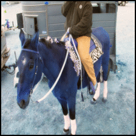
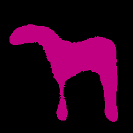
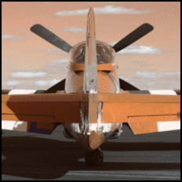
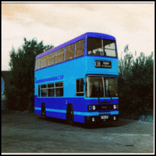
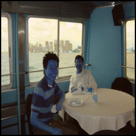
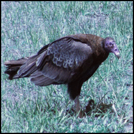
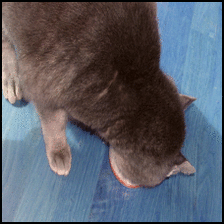

````diff
-                       Team : ASM [Ashutosh Mishra, Murtuza Bohra, Shyam Nandan Rai]                   
````

### Laplacian-Pyramid-Reconstruction-and-Refinement-for-Semantic-Segmentation

Repository contains code and models for the method described in:

[Golnaz Ghiasi, Charless C. Fowlkes, "Laplacian Pyramid Reconstruction and
Refinement for Semantic Segmentation", ECCV 2016](http://arxiv.org/abs/1605.02264)

#### Requirements

* pytorch >=0.3.0
* torchvision ==0.2.0
* Jupyter Notebook

#### Datset 
* Pascal VOC

#### Pre-trained models
* Pre-trained models 32x [LINK](https://drive.google.com/open?id=12Anxqrr4-3tg_TAPHImdPv8cgk6LX_oN).
* Pre-trained Full Model [LINK](https://drive.google.com/open?id=15DLqN3e6aCxXI81DQGu2oiWdJnOgeSl4).

#### Usage
* To use pre-trained model download it using the links above and store it in folder "Model". Now, these models
  can be used using Visualization Notebook.
* For training the model just run the model LRRVGG16 Notebook.
* Visualization of results of pretrained/trained model can be done using Visualization Notebook.

#### Results





